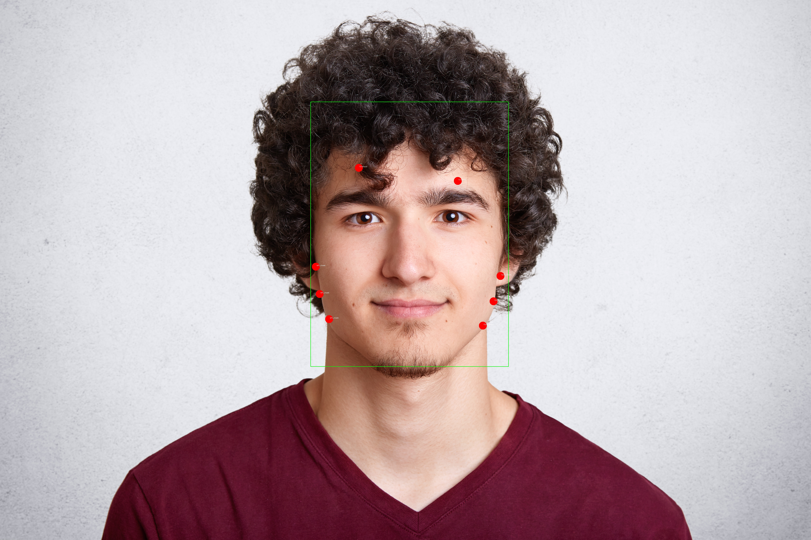

# AI-Face-Image-Processing
This project is a high-accuracy, multi-face color extraction pipeline built in **Python** using **OpenCV**. It detects multiple faces in an image, identifies key facial landmarks (like forehead, cheeks), and samples **skin tone RGB values** at those regions with precision.

🚀 It uses:
- **Deep Neural Networks (DNN)** for robust face detection
- **Facial landmark detection (LBF model)**
- **Skin segmentation (YCrCb masking)**
- **Geometric face alignment**
- **Dynamic patch sizing**
- **Multi-point sampling** for noise-resilient skin tone estimation

---

## 📌 Features

- ✅ Multi-face support  
- ✅ Accurate RGB sampling from key facial regions (forehead, left cheek, right cheek)  
- ✅ Dynamic patch sizing based on face width  
- ✅ Automatic face alignment for tilt correction  
- ✅ Skin-segmentation-based sampling (filters out non-skin regions like hair or background)  
- ✅ Annotated image output for validation  
- ✅ Output in structured JSON format  
- ✅ Clean error handling

---

## 📂 Sample Output

### 🖼️ Annotated Image:
Each detected face is outlined, and sampled landmark points are marked on the **original image** like this:

- Green box: face boundary  
- Red dots: sampling regions (forehead, cheeks)  
- Labels show region names  

### 🧾 JSON Output:
```json
{
  "image": "group_photo.jpg",
  "faces": [
    {
      "id": 0,
      "colors": {
        "forehead": {"r": 191, "g": 138, "b": 122},
        "left_cheek": {"r": 198, "g": 142, "b": 128},
        "right_cheek": {"r": 193, "g": 139, "b": 123}
      },
      "landmarks_original": {
        "forehead": [{"x": 123, "y": 80}, {"x": 141, "y": 78}],
        "left_cheek": [{"x": 90, "y": 130}, ...],
        "right_cheek": [{"x": 170, "y": 132}, ...]
      }
    }
  ]
}
```
## 🛠 Installation

### 1. Clone the repository

```bash
git clone https://github.com/your-username/ai-face-image-processing.git
cd ai-face-image-processing
```

### 2. Set up a virtual environment (recommended)

```bash
python -m venv imgenv
source imgenv/bin/activate  # On Windows: imgenv\Scripts\activate
```

### 3. Install dependencies

```bash
pip install opencv-contrib-python numpy
```

## 📁 Required Files

### ✅ Pre-trained Models

- **Place the following model files in the project directory:**
    - [deploy.prototxt](https://github.com/opencv/opencv/blob/master/samples/dnn/face_detector/deploy.prototxt): Face detection model config
    - [res10_300x300_ssd_iter_140000.caffemodel](https://github.com/opencv/opencv/blob/master/samples/dnn/face_detector/res10_300x300_ssd_iter_140000.caffemodel):	Face detection weights
    - [lbfmodel.yaml](https://github.com/kurnianggoro/GSOC2017/blob/master/data/lbfmodel.yaml): Facial landmark model


## 🚀 Usage

### Run the script on one or more images:

```bash
python main.py image1.jpg image2.jpg
```
### Output:
 - **✅ JSON printed to console**

 - **✅ Annotated image saved as image1_annotated.jpg, image2_annotated.jpg, etc.**


## 🧠 How It Works

### 📷 Step 1: Face Detection
 - A pre-trained DNN (ResNet SSD) detects all faces in the input image.

### 🔍 Step 2: Facial Landmark Detection
 - For each face, 68 facial keypoints are estimated using the cv2.face.createFacemarkLBF() method.

### 🎯 Step 3: Face Alignment
 - Rotates the image so the eyes are level (using eye center angle).

 - This reduces sampling error from head tilt.

### 🧪 Step 4: Skin Region Segmentation
 - Converts the aligned image to YCrCb color space.

 - Masks out all non-skin pixels using standard threshold ranges.

### 🧬 Step 5: RGB Sampling
 - Samples multiple nearby landmarks for each region (e.g., cheeks = 3 points).

 - Averages only skin-pixels within a patch window around each point.

 - Patch radius is dynamically scaled based on face width (~2%).

### 🧵 Step 6: Visualization & Output
 - The original image is annotated with:

   - Face boxes

   - Sampled points and region names

 - Results are returned in structured JSON format for each face.

## 🧪 Testing Images

### Place your test images in the project folder and run:

```bash
python main.py group_photo.jpg
```

## Input


## Output

```json
loading data from : lbfmodel.yaml
{
  "image": "sample_one.jpg",
  "faces": [
    {
      "id": 0,
      "landmarks_original": {
        "forehead": [
          {
            "x": 2548,
            "y": 1193
          },
          {
            "x": 3251,
            "y": 1286
          }
        ],
        "left_cheek": [
          {
            "x": 2243,
            "y": 1896
          },
          {
            "x": 2270,
            "y": 2090
          },
          {
            "x": 2337,
            "y": 2269
          }
        ],
        "right_cheek": [
          {
            "x": 3429,
            "y": 2315
          },
          {
            "x": 3505,
            "y": 2142
          },
          {
            "x": 3554,
            "y": 1962
          }
        ]
      },
      "colors": {
        "forehead": {
          "r": 172,
          "g": 131,
          "b": 116
        },
        "left_cheek": {
      },
      "colors": {
        "forehead": {
          "r": 172,
          "g": 131,
          "b": 116
        },
        "left_cheek": {
          "g": 131,
          "b": 116
        },
        "left_cheek": {
          "r": 102,
          "g": 65,
          "b": 51
        },
        "right_cheek": {
          "r": 215,
          "g": 173,
          "b": 156
        }
      }
    }
  ]
}
```




## 🙋‍♂️ Author

**Made by Harshit Diwan**
